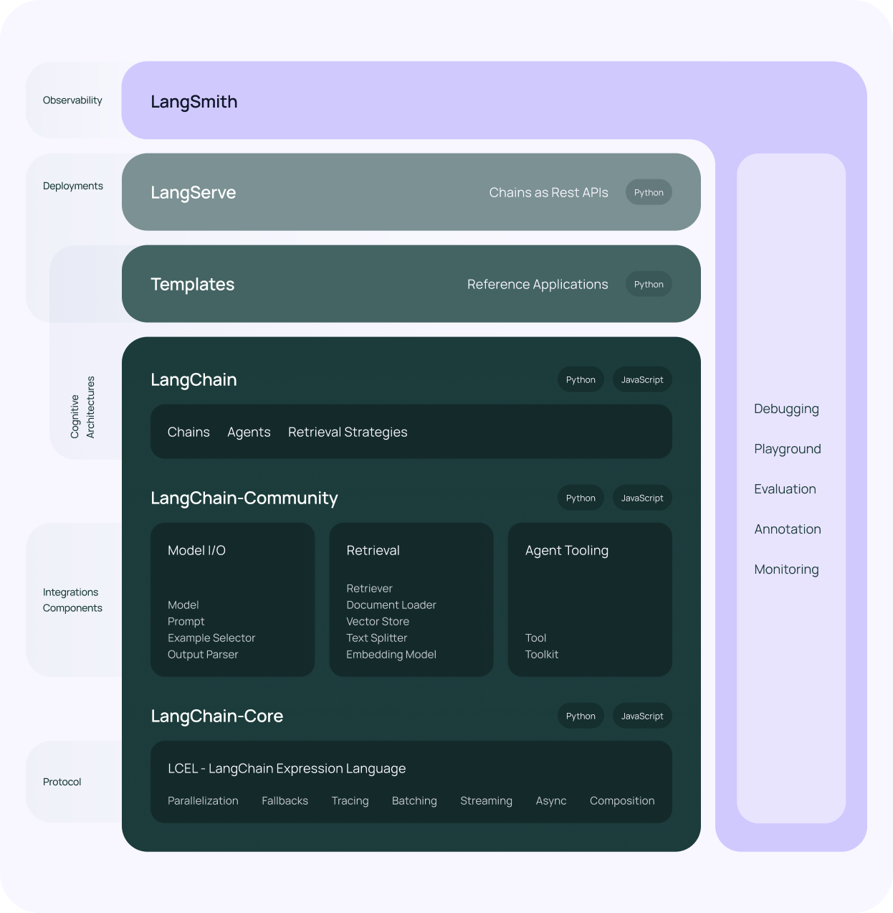

# langchain架构介绍

上面是LangChain总体架构图

- 模型(models): 支持的各种模型类型和模型集成。
- 提示(prompts) : 包括提示管理、提示优化和提示序列化。
- 内存(memory) : 内存是在链/代理调用之间保持状态的概念。说是可以进行长期记忆
- 索引(indexes) : 与自己的文本数据结合使用时，语言模型往往更加强大。
- 链(chains) : 链不仅仅是单个 LLM 调用，还包括一系列调用（无论是调用 LLM 还是不同的实用工具）,可以与其他工具集成并提供了用于常见应用程序的端到端的链调用。对话中一问一答为一步操作,很多复杂场景会分解多个操作，第一个链的结果要带入第二个链的输入。
- 代理(agents) : 代理涉及 LLM 做出行动决策、执行该行动、查看一个观察结果，并重复该过程直到完成。更高维度执行器，对任务进行分发和执行，完成一个操作需要完成哪些事情，统筹协作职责。

## 应用价值

langchain最核心的能力就是chain，如果想要用chain，你就必须用 langchain 定义的 prompt, LLMs, parser, 输入输出都是langchain自己定义的类，你想要用这些模块，你就必须去阅读这些模型的API文档和样例，然后自己举一反三去应用，问题是，模型开发得非常死板，一种需求一种模块，一个简单的业务需求，你需要阅读很多的功能模块，才能实现对应的功能

如果一个工具的学习成本，是自己实现相关功能的两倍，你还会使用这个工具吗？

## API 

memory
- https://python.langchain.com.cn/docs/modules/memory/

